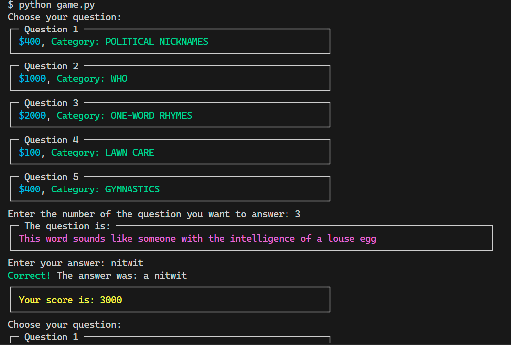

# ✨ Jeopardy Console 

A game you can play in your console, based on questions that have appeared in the [Jeopardy](https://en.wikipedia.org/wiki/Jeopardy!) TV shows.



## Features:
- Uses _fuzzy string matching_ to determine whether the answer is correct, so small variations are accepted.
- In each round, the topic can be chosen - higher risk (tougher question), higher reward.
- Keeps track of your score.
- Colorful display compatible with all modern terminal emulators with the _rich_ package.

## Usage
Tested on Python 3.10.8, might work with newer/older versions as well.

Create and activate a virtual environment, install the dependencies, and run.
```bash
python -m venv venv
source venv/Scripts/activate
pip install -r requirements.txt
python game.py
```

Uses pandas, rich, and thefuzz packages.
Feel free to contribute / send suggestions!